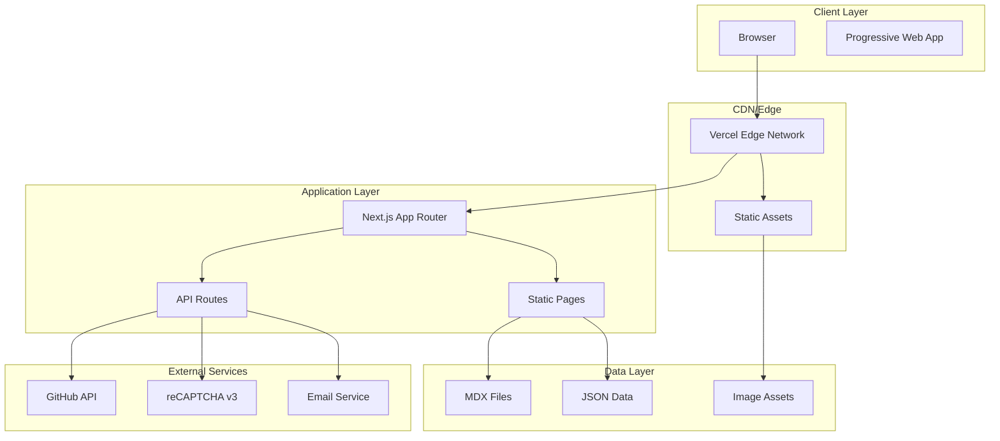
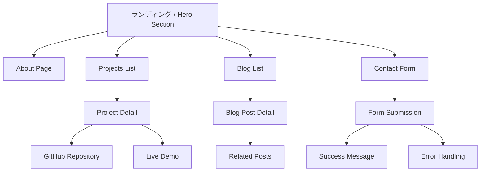
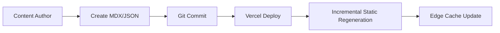
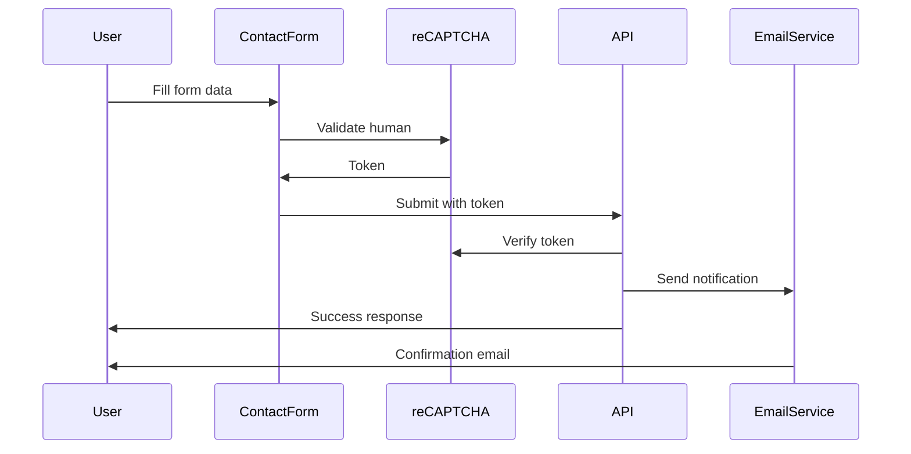
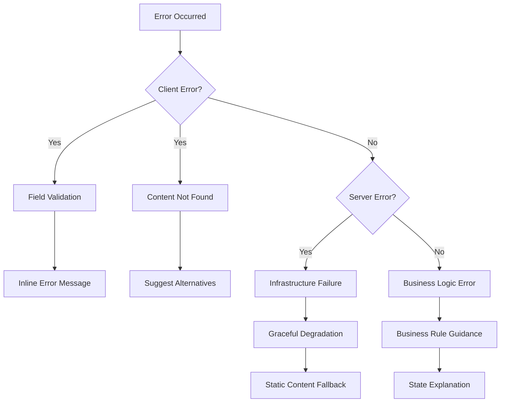

# Technical Design Document

## 概要

**目的**: このポートフォリオウェブサイトは、技術者が持つスキル・実績・人物像を効果的に伝え、採用担当者およびエンジニアとの円滑なコミュニケーションを実現する現代的なプラットフォームを提供する。

**ユーザー**: 採用担当者、エンジニアリングマネージャー、技術コミュニティメンバーが、技術者の評価、技術的深度の確認、ネットワーキングのためにこのサイトを利用する。

**インパクト**: 従来の静的レジュメから、インタラクティブで技術力を実証可能なデジタルプラットフォームへの変革を実現する。

### Goals

- Next.js 15.1+ + React 19 による最新の Web 技術実装
- React 19 Actions、useActionState、useOptimistic を活用した最新 UX
- Core Web Vitals 90 点以上のハイパフォーマンス実現
- WCAG 2.1 Level AA 準拠のアクセシビリティ確保
- 日英バイリンガル対応による国際的な採用機会拡大

### Non-Goals

- 動的なユーザー登録・ログイン機能（個人サイトのため）
- リアルタイムチャット機能（Phase 2 での検討事項）
- 第三者によるコメント・レビュー機能
- CMS ダッシュボード（Phase 1 ではファイルベース管理）

## Architecture

### High-Level Architecture



### Technology Stack and Design Decisions

**Core Framework Decision**:

- **選択**: Next.js 15.1+ with React 19 Stable
- **コンテキスト**: 最新の React 機能と SSG/ISR、SEO 最適化が必要
- **選択理由**: React Server Components 安定版、新 Actions API、useActionState/useOptimistic hooks、Turbopack 安定版
- **代替案考慮**: Next.js 14.2 + React 18（安定性重視）、Next.js 15 + React 18（Pages Router 使用）
- **トレードオフ**: 最新機能の利用可能だが、第三者ライブラリの互換性確認が必要

**State Management Decision**:

- **選択**: React 19 Actions + useActionState + React Context (theme/locale)
- **コンテキスト**: フォーム状態管理とサーバー通信の最適化が必要
- **選択理由**: React 19 の新 Actions 機能で pending/error 状態自動管理、SWR 不要
- **代替案考慮**: 従来の SWR + React Context、TanStack Query
- **トレードオフ**: React 19 に依存するが、ボイラープレート大幅削減

**Content Management Decision**:

- **選択**: File-based (MDX + JSON) with React 19 Document Metadata
- **コンテキスト**: Git 版管理統合とシンプルな更新フローが必要
- **選択理由**: バックアップ自動化、バージョン履歴、外部依存なし、React 19 ネイティブメタデータ対応
- **代替案考慮**: Headless CMS (Contentful/Sanity)、Database + CMS
- **トレードオフ**: 管理 UI はないが、開発者には最適な体験、React 19 で SEO メタデータ管理簡素化

**React 19 Modern APIs Decision**:

- **選択**: useActionState (form handling) + useOptimistic (UI updates) + Server Actions
- **コンテキスト**: お問い合わせフォームと動的コンテンツの最適な UX 実現
- **選択理由**: サーバー送信の pending/error 状態自動管理、楽観的更新による即時フィードバック、Server Actions による型安全性
- **代替案考慮**: 従来の useState + useTransition、React Hook Form、API Routes
- **トレードオフ**: React 19 限定機能だが、大幅なコード簡素化と型安全性向上

## System Flows

### User Navigation Flow



### Content Generation Flow



### Contact Form Flow



## Requirements Traceability

| Requirement | Summary                            | Components                              | Interfaces                         | Flows                   |
| ----------- | ---------------------------------- | --------------------------------------- | ---------------------------------- | ----------------------- |
| 1.1-1.5     | ヒーローセクション・ナビゲーション | HeroSection, Navigation, Layout         | React Components, Link Navigation  | User Navigation Flow    |
| 2.1-2.5     | プロジェクトポートフォリオ         | ProjectList, ProjectCard, ProjectDetail | Project Data API, Filter Interface | Content Generation Flow |
| 3.1-3.4     | レジュメ・経歴管理                 | Resume, SkillsSection, PDFGenerator     | JSON Data Interface, PDF API       | Static Content Flow     |
| 4.1-4.6     | セキュアお問い合わせ               | ContactForm, Validation, EmailAPI       | Form Interface, reCAPTCHA API      | Contact Form Flow       |
| 5.1-5.5     | ブログシステム                     | BlogList, BlogPost, MDXRenderer         | MDX Processing, Tag Filter         | Content Generation Flow |
| 6.1-6.5     | UX・アクセシビリティ               | ThemeProvider, ResponsiveLayout         | Context API, CSS Media Queries     | Theme Switch Flow       |
| 7.1-7.4     | パフォーマンス・SEO                | SEOHead, ImageOptimization              | Meta API, Image Component          | Performance Monitoring  |
| 8.1-8.4     | 多言語対応                         | I18nProvider, LocaleSwitch              | Locale Context, URL Routing        | Language Switch Flow    |

## Components and Interfaces

### Presentation Layer

#### HeroSection Component

**Responsibility & Boundaries**

- **Primary Responsibility**: ファーストビューでの印象形成とソーシャルリンク提供
- **Domain Boundary**: ユーザー第一印象とナビゲーション起点
- **Data Ownership**: プロフィール基本情報とソーシャルリンク設定

**Dependencies**

- **Inbound**: Home Page Layout
- **Outbound**: Image Optimization, Social Links, ThemeProvider
- **External**: GitHub API (contribution count), Social Platform APIs

**Contract Definition**

```typescript
interface HeroSectionProps {
  profile: {
    name: string;
    title: string;
    description: string;
    imageUrl: string;
    socialLinks: SocialLink[];
  };
  stats?: {
    githubContributions: number;
    projectCount: number;
    blogPostCount: number;
  };
}

interface SocialLink {
  platform: "github" | "linkedin" | "twitter";
  url: string;
  icon: ReactNode;
}
```

#### ProjectComponents Domain

#### ProjectList Component

**Responsibility & Boundaries**

- **Primary Responsibility**: プロジェクト一覧表示とフィルタリング機能
- **Domain Boundary**: プロジェクト発見とカテゴライゼーション
- **Data Ownership**: プロジェクトメタデータとフィルター状態

**Contract Definition**

```typescript
interface ProjectListProps {
  projects: Project[];
  filters: {
    technologies: string[];
    categories: string[];
    years: number[];
  };
  onFilterChange: (filters: ProjectFilters) => void;
}

interface Project {
  id: string;
  title: string;
  description: string;
  technologies: string[];
  category: ProjectCategory;
  githubUrl?: string;
  demoUrl?: string;
  imageUrl: string;
  featured: boolean;
  startDate: Date;
  endDate?: Date;
}

type ProjectCategory =
  | "web-app"
  | "mobile-app"
  | "library"
  | "tool"
  | "experiment";
```

#### ContactForm Component

**Responsibility & Boundaries**

- **Primary Responsibility**: セキュアな問い合わせフォームとバリデーション
- **Domain Boundary**: 外部コミュニケーション開始点
- **Data Ownership**: フォーム入力データと送信状態管理

**Dependencies**

- **External**: reCAPTCHA v3, Email Service API (SendGrid/Resend)

**External Dependencies Investigation**

- **reCAPTCHA v3**: スコアベース認証（0-1.0）、非侵入的ユーザー体験
- **Email Service**: SendGrid または Resend API、配信保証と到達率重視
- **Rate Limiting**: Vercel Edge Functions での実装、IP/時間単位制限

**Contract Definition**

```typescript
// React 19 Action-based Form Handling
interface ContactFormData {
  name: string;
  email: string;
  subject: string;
  message: string;
  recaptchaToken: string;
}

// Server Action Definition (React 19)
async function submitContactForm(
  prevState: ContactFormState,
  formData: FormData
): Promise<ContactFormState> {
  // Server-side validation and email sending
  // Returns new state with pending/error/success
}

// useActionState Hook State (React 19)
interface ContactFormState {
  success: boolean;
  message: string;
  errors?: Partial<Record<keyof ContactFormData, string>>;
  pending?: boolean; // Automatically managed by React 19
}

// Component Implementation with React 19 APIs
const ContactForm = () => {
  const [state, action, isPending] = useActionState(submitContactForm, {
    success: false,
    message: "",
  });

  // useOptimistic for immediate UI feedback
  const [optimisticState, addOptimistic] = useOptimistic(
    state,
    (current, newMessage) => ({ ...current, message: newMessage })
  );
};
```

### Data Layer

#### BlogSystem Domain

#### MDXProcessor Component

**Responsibility & Boundaries**

- **Primary Responsibility**: MDX ファイルの処理とコンテンツレンダリング
- **Domain Boundary**: 技術記事コンテンツ管理
- **Data Ownership**: ブログポストメタデータとコンテンツ

**Dependencies**

- **External**: @next/mdx, rehype-highlight, remark-gfm, gray-matter
- **React 19**: Native ref prop (forwardRef deprecated), document metadata support

**Contract Definition**

```typescript
interface BlogPost {
  slug: string;
  frontmatter: {
    title: string;
    description: string;
    date: Date;
    tags: string[];
    category: BlogCategory;
    featured: boolean;
    readingTime: number;
  };
  content: string;
  tableOfContents: TOCItem[];
}

interface TOCItem {
  id: string;
  title: string;
  level: number;
  children?: TOCItem[];
}

type BlogCategory = "tutorial" | "insight" | "case-study" | "opinion";
```

### Integration Layer

#### InternationalizationProvider

**Responsibility & Boundaries**

- **Primary Responsibility**: 多言語コンテンツ管理と言語切り替え
- **Domain Boundary**: アプリケーション全体の国際化
- **Data Ownership**: 言語設定とローカライゼーション状態

**Contract Definition**

```typescript
// React 19 Updated: ref prop directly supported
interface I18nConfig {
  defaultLocale: "ja" | "en";
  locales: Array<"ja" | "en">;
  urlPathPattern: "/[locale]/[...path]";
}

interface I18nContext {
  locale: "ja" | "en";
  setLocale: (locale: "ja" | "en") => void;
  t: (key: string, params?: Record<string, string>) => string;
}

// React 19 Server Action for locale switching
async function setLocaleAction(locale: "ja" | "en"): Promise<void> {
  "use server";
  // Server-side locale setting with cookie/session
}
```

## Data Models

### Content Data Model

#### Project Domain Model

**Core Concepts**:

- **Project Aggregate**: プロジェクト基本情報とメタデータの集約
- **Technology Entity**: 技術スタック情報と習熟度
- **Project Status Value Object**: プロジェクト状況の不変表現

**Business Rules & Invariants**:

- 全プロジェクトは一意の slug を持つ
- featured プロジェクトは最大 5 個まで
- 開始日は終了日より前である（終了日が存在する場合）

```typescript
interface ProjectAggregate {
  // Identity
  id: ProjectId;
  slug: string;

  // Basic Information
  title: string;
  description: string;
  detailContent?: string; // MDX content path

  // Technical Information
  technologies: Technology[];
  category: ProjectCategory;
  complexity: ComplexityLevel;

  // External Links
  githubUrl?: URL;
  demoUrl?: URL;

  // Presentation
  imageUrl: string;
  featured: boolean;

  // Timeline
  timeline: {
    startDate: Date;
    endDate?: Date;
    status: ProjectStatus;
  };

  // Metadata
  createdAt: Date;
  updatedAt: Date;
}

type ProjectStatus =
  | "planning"
  | "in-progress"
  | "completed"
  | "maintained"
  | "archived";
type ComplexityLevel = "simple" | "intermediate" | "complex" | "expert";
```

#### Blog Domain Model

**Core Concepts**:

- **BlogPost Aggregate**: 記事コンテンツと関連メタデータ
- **Tag Value Object**: カテゴライゼーション用タグ
- **Reading Stats Value Object**: 読了時間とエンゲージメント

```typescript
interface BlogPostAggregate {
  // Identity
  slug: string;

  // Content
  frontmatter: BlogFrontmatter;
  content: string; // MDX content
  tableOfContents: TOCItem[];

  // Engagement
  readingStats: {
    estimatedMinutes: number;
    wordCount: number;
  };

  // Relationships
  relatedPosts: string[]; // slugs

  // Metadata
  publishedAt: Date;
  updatedAt?: Date;
}

interface BlogFrontmatter {
  title: string;
  description: string;
  tags: string[];
  category: BlogCategory;
  featured: boolean;
  draft?: boolean;
}
```

### Physical Data Model

#### File System Structure

```
content/
├── projects/
│   ├── projects.json              # Project metadata index
│   └── details/
│       ├── portfolio-site.mdx     # Project detail content
│       └── ecommerce-app.mdx
├── blog/
│   ├── 2025-01-15-nextjs-patterns.mdx
│   └── 2025-02-01-typescript-tips.mdx
├── data/
│   ├── profile.json              # Personal information
│   ├── skills.json              # Technical skills matrix
│   ├── experience.json          # Work experience
│   └── i18n/
│       ├── ja.json              # Japanese translations
│       └── en.json              # English translations
└── images/
    ├── projects/
    ├── blog/
    └── profile/
```

#### Data Validation Schema

```typescript
// Zod schemas for runtime validation
const ProjectSchema = z.object({
  id: z.string().min(1),
  slug: z.string().regex(/^[a-z0-9-]+$/),
  title: z.string().min(1).max(100),
  description: z.string().min(10).max(500),
  technologies: z.array(z.string()).min(1),
  category: z.enum(["web-app", "mobile-app", "library", "tool", "experiment"]),
  featured: z.boolean(),
  startDate: z.date(),
  endDate: z.date().optional(),
  githubUrl: z.string().url().optional(),
  demoUrl: z.string().url().optional(),
});
```

## Error Handling

### Error Strategy

Next.js App Router のエラーバウンダリーと React Error Boundaries を活用した階層的エラー処理を実装する。各レイヤーで適切なエラー処理と復旧メカニズムを提供する。

### Error Categories and Responses

**Client Errors (4xx)**:

- **Invalid Input (400)**: フィールドレベル validation エラー → インラインエラーメッセージ表示
- **Unauthorized (401)**: 認証が必要な操作 → 適切な権限取得ガイダンス
- **Not Found (404)**: 存在しないコンテンツ → ナビゲーションヘルプと関連コンテンツ提案
- **Rate Limited (429)**: API 制限到達 → 再試行時間の明示と代替手段提案

**Server Errors (5xx)**:

- **Infrastructure Failures (500)**: サーバー障害 → graceful degradation と静的コンテンツ表示
- **Timeouts (504)**: 外部 API 応答遅延 → circuit breaker パターンとキャッシュフォールバック
- **Resource Exhaustion (503)**: リソース不足 → rate limiting と優先度ベース処理

**Business Logic Errors (422)**:

- **Rule Violations**: ビジネスルール違反 → 条件説明と修正ガイド
- **State Conflicts**: 状態矛盾 → 現在状態の明示と有効な遷移オプション



### Monitoring

- **Error Tracking**: Vercel Analytics + Custom Error Boundary でクライアントエラー追跡
- **Logging**: Next.js logger + structured logging で運用可視性確保
- **Health Monitoring**: API endpoints の応答時間とエラー率監視
- **User Experience**: Real User Monitoring でユーザー影響度測定

## Testing Strategy

### Unit Tests

- **React 19 Server Actions**: submitContactForm などの Server Action 関数
- **React 19 Hooks**: useActionState, useOptimistic の状態遷移テスト
- **Content Processing**: MDX processor と frontmatter 解析
- **Utility Functions**: 日付フォーマット、URL 生成、テキスト処理
- **Context Providers**: Theme、Language、User Preferences 状態管理
- **Business Logic**: プロジェクトフィルタリング、検索機能

### Integration Tests

- **React 19 Actions**: Server Actions と Client Component の統合フロー
- **Form Submission**: useActionState による送信から結果表示まで
- **Content Loading**: MDX/JSON ファイル読み込みから表示まで
- **External Service Integration**: GitHub API、reCAPTCHA、Email service 連携
- **Language Switching**: Server Actions による国際化切り替えフロー
- **Theme Management**: React 19 最適化による状態管理

### E2E/UI Tests

- **Core User Journey**: ランディング → プロジェクト → 詳細 → お問い合わせ
- **Contact Form Workflow**: フォーム入力 → 検証 → 送信 → 確認
- **Content Navigation**: ブログ一覧 → 記事詳細 → 関連記事遷移
- **Responsive Behavior**: モバイル/デスクトップでの表示と操作
- **Accessibility Navigation**: キーボード/スクリーンリーダー操作

### Performance/Load Tests

- **Core Web Vitals**: LCP < 2.5s、FID < 100ms、CLS < 0.1 の継続達成
- **Content Loading**: 大量プロジェクト・記事データでのページ読み込み性能
- **Image Optimization**: 異なるデバイスサイズでの画像配信最適化
- **Contact Form Load**: 同時送信時の API 応答性能と rate limiting 効果

## Security Considerations

### Threat Modeling

**Attack Vectors Analysis**:

- **XSS (Cross-Site Scripting)**: MDX コンテンツと user input による script injection
- **CSRF (Cross-Site Request Forgery)**: Contact form での不正リクエスト
- **Data Injection**: Contact form input での SQL injection や command injection
- **DDoS/Abuse**: Contact form spam と API rate limiting 回避

### Security Controls

**Input Validation & Sanitization**:

- **Contact Form**: Zod schema validation + DOMPurify sanitization
- **MDX Content**: Trusted source のみ + rehype-sanitize plugin
- **File Uploads**: 画像ファイルのみ許可、拡張子・MIME type verification
- **URL Parameters**: Next.js router による自動エスケープ + custom validation

**Authentication & Authorization**:

- **Admin Functions**: GitHub OAuth integration for content management (Phase 2)
- **API Protection**: reCAPTCHA v3 + rate limiting + IP-based restriction
- **Content Access**: 全コンテンツ公開だが、draft content は環境変数制御

**Data Protection & Privacy**:

- **Personal Information**: Contact form data の最小限収集と暗号化保存
- **Privacy Policy**: GDPR/CCPA compliance のプライバシーポリシー実装
- **Cookie Management**: 必須 cookie のみ + user consent management
- **Data Retention**: Contact inquiry の自動削除ポリシー（6 ヶ月後）

### Compliance Requirements

- **WCAG 2.1 Level AA**: アクセシビリティ標準準拠
- **GDPR**: EU 居住者データ保護要件
- **Content Security Policy**: XSS 防止のための strict CSP header
- **Security Headers**: HSTS、X-Frame-Options、X-Content-Type-Options

## Performance & Scalability

### Target Metrics

**Core Web Vitals**:

- **Largest Contentful Paint (LCP)**: < 2.0 秒
- **First Input Delay (FID)**: < 50ms
- **Cumulative Layout Shift (CLS)**: < 0.05

**Additional Performance Metrics**:

- **Time to Interactive (TTI)**: < 3.0 秒
- **Total Blocking Time (TBT)**: < 150ms
- **Speed Index**: < 2.5 秒

### Scaling Approaches

**Content Delivery Optimization**:

- **Static Generation**: 全ページの事前生成でサーバー負荷最小化
- **Edge Caching**: Vercel Edge Network による global distribution
- **Image Optimization**: Next.js Image component + WebP/AVIF format
- **Code Splitting**: Route-based + component-based 動的インポート

**Data Management Scaling**:

- **Incremental Static Regeneration**: 新コンテンツ公開時の部分的再生成
- **Build Optimization**: Parallel processing + incremental builds
- **Asset Optimization**: CSS/JS minification + tree shaking

**Horizontal Scaling Strategy**:

- **Vercel Serverless**: 自動スケーリングと pay-per-use モデル
- **CDN Distribution**: Multi-region content distribution
- **API Rate Limiting**: Abuse protection + fair usage policy

### Caching Strategies

**Static Content Caching**:

- **Build-time Generation**: 99% のコンテンツを静的生成
- **Browser Caching**: 長期キャッシュ + immutable assets
- **Service Worker**: Offline-first caching strategy (Phase 2)

**Dynamic Content Caching**:

- **SWR Pattern**: Stale-while-revalidate でユーザー体験と鮮度両立
- **GitHub API**: Repository stats の 1 時間キャッシュ
- **Contact Form**: Rate limiting + temporary session storage
