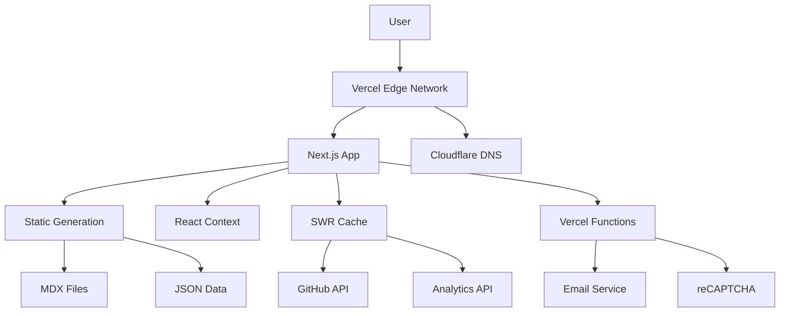
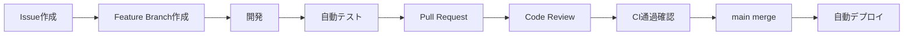

# Technical Design Document

## ポートフォリオサイト

---

### Document Information

- **Project**: Portfolio Website
- **Version**: 1.0.0
- **Last Updated**: 2025 年 9 月 28 日
- **Author**: aoyama01
- **Status**: Draft

---

## Table of Contents

1. [システム概要](#1-システム概要)
2. [アーキテクチャ決定記録 (ADR)](#2-アーキテクチャ決定記録-adr)
3. [システムアーキテクチャ](#3-システムアーキテクチャ)
4. [技術スタック詳細](#4-技術スタック詳細)
5. [データ設計](#5-データ設計)
6. [セキュリティ設計](#6-セキュリティ設計)
7. [パフォーマンス設計](#7-パフォーマンス設計)
8. [デプロイメント設計](#8-デプロイメント設計)

---

## 1. システム概要

### 1.1 技術的ビジョン

モダンな Web 技術を活用し、高パフォーマンス・高可用性・保守性を兼ね備えた個人ポートフォリオサイトを構築する。技術選択自体がポートフォリオとしての価値を持つよう、最新のベストプラクティスを実装する。

### 1.2 技術的要件

- **パフォーマンス**: Core Web Vitals 全項目で 90 点以上
- **アクセシビリティ**: WCAG 2.1 Level AA 準拠
- **SEO**: 検索エンジン最適化の完全実装
- **保守性**: TypeScript + モダンな開発ツールチェーン
- **拡張性**: 段階的な機能追加に対応

---

## 2. アーキテクチャ決定記録 (ADR)

### ADR-001: フレームワーク選択 - Next.js 14+

**Status**: ✅ Accepted
**Date**: 2025-09-28

#### Context

ポートフォリオサイトのフロントエンドフレームワークを選択する必要がある。要件として、SSG/SSR 対応、SEO 最適化、パフォーマンス、開発体験が重要。

#### Decision

Next.js 14+ (App Router) を採用

#### Rationale

| Factor       | Next.js           | Gatsby         | Nuxt.js    | Astro        |
| ------------ | ----------------- | -------------- | ---------- | ------------ |
| SSG/SSR      | ✅ 優秀           | ✅ SSG に特化  | ✅ 優秀    | ✅ 優秀      |
| SEO          | ✅ 標準対応       | ✅ 良好        | ✅ 良好    | ✅ 優秀      |
| エコシステム | ✅ 最大           | △ GraphQL 依存 | ○ Vue 特化 | △ 新しい     |
| 学習コスト   | ✅ React 知識活用 | △ GraphQL 必要 | △ Vue 必要 | △ 新しい概念 |
| 就職市場価値 | ✅ 最高           | ○ 中程度       | ○ 中程度   | △ 限定的     |

#### Consequences

- **Pros**: React 生態系の活用、豊富な学習リソース、就職市場での評価
- **Cons**: 設定の複雑さ、バンドルサイズ

---

### ADR-002: スタイリングソリューション - Tailwind CSS

**Status**: ✅ Accepted
**Date**: 2025-09-28

#### Context

CSS 管理とデザインシステムの実装方法を決定する必要がある。保守性、開発速度、バンドルサイズを考慮。

#### Decision

Tailwind CSS 3+ + CSS Modules（必要に応じて）

#### Rationale

| Solution           | Tailwind CSS        | Styled Components | CSS Modules | Chakra UI  |
| ------------------ | ------------------- | ----------------- | ----------- | ---------- |
| 開発速度           | ✅ 最速             | ○ 中程度          | △ 遅い      | ✅ 速い    |
| バンドルサイズ     | ✅ 最適化済み       | △ JS 依存         | ✅ 最小     | △ 大きい   |
| デザイン自由度     | ✅ 最高             | ✅ 高い           | ✅ 高い     | △ 制限あり |
| 学習コスト         | ○ クラス名学習      | △ CSS-in-JS       | ✅ 低い     | ○ API 学習 |
| ポートフォリオ価値 | ✅ 高い（トレンド） | ○ 中程度          | △ 低い      | ○ 中程度   |

#### Consequences

- **Pros**: 高速開発、最適化された CSS、現代的なアプローチ
- **Cons**: クラス名の冗長性、初期学習コスト

---

### ADR-003: ホスティングプラットフォーム - Vercel

**Status**: ✅ Accepted
**Date**: 2025-09-28

#### Context

静的サイト配信と CI/CD パイプラインの実装プラットフォームを選択。

#### Decision

Vercel + Cloudflare DNS

#### Rationale

| Platform         | Vercel  | Netlify | GitHub Pages | AWS S3 + CloudFront |
| ---------------- | ------- | ------- | ------------ | ------------------- |
| Next.js 最適化   | ✅ 完璧 | ○ 良好  | △ 制限あり   | ○ 設定次第          |
| 無料枠           | ✅ 十分 | ✅ 十分 | ✅ 無制限    | △ 制限あり          |
| CI/CD            | ✅ 自動 | ✅ 自動 | ✅ 自動      | △ 手動設定          |
| 管理コスト       | ✅ 最小 | ✅ 最小 | ✅ 最小      | △ 高い              |
| スケーラビリティ | ✅ 自動 | ✅ 自動 | △ 制限あり   | ✅ 無制限           |

#### Consequences

- **Pros**: ゼロ設定、自動最適化、優秀な DX
- **Cons**: ベンダーロックイン、高度なカスタマイズの制限

---

### ADR-004: 状態管理 - React Context + SWR

**Status**: ✅ Accepted
**Date**: 2025-09-28

#### Context

グローバル状態管理とデータフェッチングの実装方法を決定。

#### Decision

- **グローバル状態**: React Context (theme, language)
- **サーバー状態**: SWR (GitHub API 等)
- **ローカル状態**: useState/useReducer

#### Rationale

| Solution                 | Context + SWR | Redux Toolkit  | Zustand     | TanStack Query |
| ------------------------ | ------------- | -------------- | ----------- | -------------- |
| 複雑度                   | ✅ シンプル   | △ 複雑         | ✅ シンプル | ○ 中程度       |
| バンドルサイズ           | ✅ 最小       | △ 大きい       | ✅ 小さい   | ○ 中程度       |
| 学習コスト               | ✅ 最小       | △ 高い         | ○ 低い      | ○ 中程度       |
| ポートフォリオサイト適性 | ✅ 最適       | △ オーバーキル | ✅ 適切     | ✅ 適切        |

#### Consequences

- **Pros**: 実装の簡潔性、React 標準に準拠、学習コスト最小
- **Cons**: 複雑な状態管理には不向き（本プロジェクトでは問題なし）

---

### ADR-005: コンテンツ管理 - MDX + JSON (Phase 1)

**Status**: ✅ Accepted
**Date**: 2025-09-28

#### Context

ブログ記事とプロジェクト情報の管理方法を決定。

#### Decision

**Phase 1**: MDX (ブログ) + JSON (プロジェクト構造データ)
**Phase 2**: Headless CMS 検討 (Contentful/Sanity)

#### Rationale

| Solution       | MDX + JSON  | Headless CMS       | WordPress  | 直接 DB    |
| -------------- | ----------- | ------------------ | ---------- | ---------- |
| 初期コスト     | ✅ ゼロ     | △ 有料プランあり   | ○ 無料     | △ インフラ |
| 開発速度       | ✅ 最速     | ○ セットアップ必要 | △ 遅い     | △ 遅い     |
| バージョン管理 | ✅ Git 統合 | △ 外部システム     | △ 困難     | △ 困難     |
| ポータビリティ | ✅ 最高     | △ ベンダー依存     | △ 移行困難 | ○ 制御可能 |

#### Consequences

- **Pros**: 完全な制御、バージョン管理統合、コスト最小
- **Cons**: 画像管理の手動作業

---

## 3. システムアーキテクチャ

### 3.1 全体アーキテクチャ



### 3.2 ディレクトリ構造

```
portfolio/
├── src/
│   ├── app/                 # Next.js App Router
│   │   ├── [locale]/        # 国際化ルーティング
│   │   │   ├── page.tsx     # ホームページ
│   │   │   ├── about/       # 自己紹介
│   │   │   ├── projects/    # プロジェクト一覧・詳細
│   │   │   ├── resume/      # レジュメ
│   │   │   ├── blog/        # ブログ一覧・詳細
│   │   │   ├── contact/     # お問い合わせ
│   │   │   └── api/         # API Routes
│   │   ├── globals.css      # グローバルスタイル
│   │   └── layout.tsx       # ルートレイアウト
│   ├── components/          # React コンポーネント
│   │   ├── ui/              # 基本UIコンポーネント
│   │   │   ├── Button.tsx
│   │   │   ├── Card.tsx
│   │   │   ├── Input.tsx
│   │   │   └── Modal.tsx
│   │   ├── layout/          # レイアウトコンポーネント
│   │   │   ├── Header.tsx
│   │   │   ├── Footer.tsx
│   │   │   ├── Navigation.tsx
│   │   │   └── SEO.tsx
│   │   ├── features/        # 機能別コンポーネント
│   │   │   ├── home/
│   │   │   ├── projects/
│   │   │   ├── blog/
│   │   │   └── contact/
│   │   └── providers/       # Context Providers
│   │       ├── ThemeProvider.tsx
│   │       ├── LanguageProvider.tsx
│   │       └── SWRProvider.tsx
│   ├── lib/                 # ユーティリティ・設定
│   │   ├── utils.ts         # 汎用ユーティリティ
│   │   ├── constants.ts     # 定数定義
│   │   ├── mdx.ts          # MDX処理
│   │   ├── api.ts          # API クライアント
│   │   └── validations.ts   # バリデーション
│   ├── hooks/              # カスタムフック
│   │   ├── useTheme.ts
│   │   ├── useLanguage.ts
│   │   └── useLocalStorage.ts
│   ├── types/              # TypeScript型定義
│   │   ├── project.ts
│   │   ├── blog.ts
│   │   └── common.ts
│   └── styles/             # 追加スタイル
│       └── components.css   # コンポーネント固有スタイル
├── content/                # コンテンツファイル
│   ├── projects/           # プロジェクト情報
│   │   ├── projects.json   # プロジェクト一覧
│   │   └── details/        # プロジェクト詳細MDX
│   ├── blog/              # ブログ記事MDX
│   └── data/              # 静的データ
│       ├── skills.json
│       ├── experience.json
│       └── personal.json
├── public/                # 静的ファイル
│   ├── images/           # 画像ファイル
│   ├── documents/        # PDFファイル等
│   ├── icons/           # アイコンファイル
│   ├── robots.txt
│   └── sitemap.xml
├── docs/                # プロジェクト文書
├── tests/               # テストファイル
│   ├── __mocks__/
│   ├── components/
│   ├── pages/
│   └── utils/
└── config/             # 設定ファイル
    ├── next.config.js
    ├── tailwind.config.js
    ├── tsconfig.json
    └── jest.config.js
```

---

## 4. 技術スタック詳細

### 4.1 フロントエンド

#### Core Framework

```yaml
Next.js: 14.2+
  - App Router使用
  - TypeScript strict mode
  - 静的生成 (SSG) メイン
  - サーバーサイドレンダリング (SSR) 必要に応じて
```

#### UI・スタイリング

```yaml
Tailwind CSS: 3.4+
  - JIT (Just-In-Time) コンパイル
  - カスタムデザイントークン
  - ダークモード対応 (class strategy)
  - レスポンシブブレークポイント:
    - sm: 640px
    - md: 768px
    - lg: 1024px
    - xl: 1280px
    - 2xl: 1536px

アイコン: Lucide React
フォント: Inter (Google Fonts)
```

#### 状態管理・データフェッチング

```yaml
グローバル状態: React Context
  - ThemeContext (ダークモード)
  - LanguageContext (多言語)
  - UserPreferencesContext

データフェッチング: SWR 2.2+
  - GitHub API (リポジトリ情報)
  - 外部API統合
  - キャッシュ戦略
```

#### 開発ツール

```yaml
TypeScript: 5.2+
ESLint: 8.x + 推奨ルールセット
Prettier: 3.x + Tailwind プラグイン
Husky: Git hooks
lint-staged: ステージファイルのみ処理
```

### 4.2 コンテンツ管理

#### MDX 設定

```yaml
@next/mdx: Next.js公式MDXプラグイン
rehype-highlight: シンタックスハイライト
rehype-slug: 見出しID自動生成
remark-gfm: GitHub Flavored Markdown
gray-matter: Frontmatter解析
```

#### 静的データ

```typescript
// プロジェクト型定義例
interface Project {
  id: string;
  title: string;
  description: string;
  technologies: string[];
  githubUrl?: string;
  demoUrl?: string;
  imageUrl: string;
  featured: boolean;
  createdAt: string;
  updatedAt: string;
}
```

### 4.3 インフラ・デプロイ

#### ホスティング

```yaml
Primary: Vercel
  - 自動デプロイ (GitHub連携)
  - Edge Functions
  - 画像最適化
  - Analytics内蔵

DNS: Cloudflare
  - CDN最適化
  - セキュリティ設定
  - パフォーマンス向上
```

#### CI/CD Pipeline

```yaml
GitHub Actions:
  - PRトリガー:
      - ESLint実行
      - TypeScript型チェック
      - Jest単体テスト
      - Lighthouse CI
  - mainトリガー:
      - 本番デプロイ
      - サイトマップ更新
```

---

## 5. データ設計

### 5.1 コンテンツデータ構造

#### プロジェクトデータ (content/projects/projects.json)

```json
{
  "projects": [
    {
      "id": "portfolio-site",
      "title": "ポートフォリオサイト",
      "description": "Next.js + Tailwind CSSで構築した個人ポートフォリオ",
      "technologies": ["Next.js", "TypeScript", "Tailwind CSS"],
      "category": "web-development",
      "featured": true,
      "githubUrl": "https://github.com/username/portfolio",
      "demoUrl": "https://portfolio.example.com",
      "imageUrl": "/images/projects/portfolio-thumbnail.png",
      "status": "completed",
      "startDate": "2025-09-01",
      "endDate": "2025-10-15",
      "createdAt": "2025-09-28T00:00:00Z",
      "updatedAt": "2025-09-28T00:00:00Z"
    }
  ]
}
```

#### ブログ記事 Frontmatter

```yaml
---
title: "Next.js 14 App Routerでポートフォリオサイトを構築"
description: "最新のNext.jsを使ったポートフォリオサイト開発の知見"
date: "2025-09-28"
tags: ["Next.js", "React", "Web Development"]
category: "tutorial"
featured: true
readingTime: 10
author: "aoyama01"
---
```

#### スキルデータ (content/data/skills.json)

```json
{
  "categories": [
    {
      "name": "Frontend",
      "skills": [
        {
          "name": "React",
          "level": 4,
          "years": 2,
          "icon": "react"
        },
        {
          "name": "TypeScript",
          "level": 4,
          "years": 1.5,
          "icon": "typescript"
        }
      ]
    }
  ]
}
```

### 5.2 ローカルストレージ設計

```typescript
interface UserPreferences {
  theme: "light" | "dark" | "system";
  language: "ja" | "en";
  reducedMotion: boolean;
  cookieConsent: boolean;
}

// localStorage key: 'portfolio-preferences'
```

---

## 6. セキュリティ設計

### 6.1 セキュリティヘッダー

#### Next.js 設定 (next.config.js)

```javascript
const securityHeaders = [
  {
    key: "Content-Security-Policy",
    value: `
      default-src 'self';
      script-src 'self' 'unsafe-eval' 'unsafe-inline' *.vercel-insights.com *.google.com *.recaptcha.net;
      style-src 'self' 'unsafe-inline' fonts.googleapis.com;
      img-src 'self' data: blob: *.github.com *.githubusercontent.com;
      font-src 'self' fonts.gstatic.com;
      connect-src 'self' *.vercel-insights.com api.github.com;
      frame-src 'self' *.google.com *.recaptcha.net;
    `
      .replace(/\s{2,}/g, " ")
      .trim(),
  },
  {
    key: "X-Frame-Options",
    value: "DENY",
  },
  {
    key: "X-Content-Type-Options",
    value: "nosniff",
  },
  {
    key: "Referrer-Policy",
    value: "strict-origin-when-cross-origin",
  },
  {
    key: "Strict-Transport-Security",
    value: "max-age=31536000; includeSubDomains",
  },
];
```

### 6.2 お問い合わせフォームセキュリティ

#### バリデーション (lib/validations.ts)

```typescript
import { z } from "zod";

export const contactFormSchema = z.object({
  name: z
    .string()
    .min(2, "名前は2文字以上で入力してください")
    .max(100, "名前は100文字以内で入力してください")
    .regex(/^[^<>\"'&]*$/, "無効な文字が含まれています"),

  email: z
    .string()
    .email("有効なメールアドレスを入力してください")
    .max(255, "メールアドレスは255文字以内で入力してください"),

  subject: z
    .string()
    .min(5, "件名は5文字以上で入力してください")
    .max(200, "件名は200文字以内で入力してください")
    .regex(/^[^<>\"'&]*$/, "無効な文字が含まれています"),

  message: z
    .string()
    .min(10, "メッセージは10文字以上で入力してください")
    .max(2000, "メッセージは2000文字以内で入力してください")
    .regex(/^[^<>\"'&]*$/, "無効な文字が含まれています"),

  recaptchaToken: z.string().min(1, "reCAPTCHA認証が必要です"),
});
```

#### API Route 実装 (app/api/contact/route.ts)

```typescript
import { NextRequest, NextResponse } from "next/server";
import { contactFormSchema } from "@/lib/validations";

export async function POST(request: NextRequest) {
  try {
    const body = await request.json();

    // バリデーション
    const validatedData = contactFormSchema.parse(body);

    // reCAPTCHA検証
    const recaptchaResponse = await fetch(
      "https://www.google.com/recaptcha/api/siteverify",
      {
        method: "POST",
        headers: { "Content-Type": "application/x-www-form-urlencoded" },
        body: `secret=${process.env.RECAPTCHA_SECRET_KEY}&response=${validatedData.recaptchaToken}`,
      }
    );

    const recaptchaResult = await recaptchaResponse.json();

    if (!recaptchaResult.success) {
      return NextResponse.json(
        { error: "reCAPTCHA認証に失敗しました" },
        { status: 400 }
      );
    }

    // メール送信処理
    // ...

    return NextResponse.json({ message: "お問い合わせを受け付けました" });
  } catch (error) {
    return NextResponse.json(
      { error: "サーバーエラーが発生しました" },
      { status: 500 }
    );
  }
}
```

---

## 7. パフォーマンス設計

### 7.1 画像最適化

#### Next.js Image 設定

```typescript
// next.config.js
const nextConfig = {
  images: {
    domains: ["github.com", "raw.githubusercontent.com"],
    formats: ["image/webp", "image/avif"],
    deviceSizes: [640, 750, 828, 1080, 1200, 1920, 2048, 3840],
    imageSizes: [16, 32, 48, 64, 96, 128, 256, 384],
  },
};
```

#### 画像コンポーネント

```typescript
// components/ui/OptimizedImage.tsx
import Image from "next/image";

interface OptimizedImageProps {
  src: string;
  alt: string;
  width: number;
  height: number;
  priority?: boolean;
  className?: string;
}

export function OptimizedImage({
  src,
  alt,
  width,
  height,
  priority = false,
  className,
}: OptimizedImageProps) {
  return (
    <Image
      src={src}
      alt={alt}
      width={width}
      height={height}
      priority={priority}
      className={className}
      placeholder="blur"
      blurDataURL="data:image/jpeg;base64,/9j/4AAQSkZJRgABAQAAAQABAAD/2wBDAAYEBQYFBAYGBQYHBwYIChAKCgkJChQODwwQFxQYGBcUFhYaHSUfGhsjHBYWICwgIyYnKSopGR8tMC0oMCUoKSj/2wBDAQcHBwoIChMKChMoGhYaKCgoKCgoKCgoKCgoKCgoKCgoKCgoKCgoKCgoKCgoKCgoKCgoKCgoKCgoKCgoKCgoKCj/wAARCAABAAEDASIAAhEBAxEB/8QAFQABAQAAAAAAAAAAAAAAAAAAAAv/xAAhEAACAQMDBQAAAAAAAAAAAAABAgMABAUGIWGRkbHB0eH/xAAVAQEBAAAAAAAAAAAAAAAAAAAAAf/EABQRAQAAAAAAAAAAAAAAAAAAAAD/2gAMAwEAAhEDEQA/AJVGopxCoD8FA3n8gTBR8ECQR5n5FBCQBhQuD/VqNDGElGOg89PnIIIf/9k="
      sizes="(max-width: 768px) 100vw, (max-width: 1200px) 50vw, 33vw"
    />
  );
}
```

### 7.2 バンドル最適化

#### Dynamic Imports

```typescript
// 重いコンポーネントの遅延読み込み
const ContactForm = dynamic(
  () => import("@/components/features/contact/ContactForm"),
  {
    loading: () => (
      <div className="animate-pulse bg-gray-200 h-96 rounded-lg" />
    ),
    ssr: false,
  }
);

const CodeEditor = dynamic(() => import("@/components/ui/CodeEditor"), {
  ssr: false,
});
```

#### Tree Shaking

```typescript
// utils/index.ts - 必要な関数のみエクスポート
export { formatDate } from "./formatDate";
export { truncateText } from "./truncateText";
export { debounce } from "./debounce";

// 使用側では必要な関数のみインポート
import { formatDate, truncateText } from "@/lib/utils";
```

### 7.3 キャッシュ戦略

#### ISR (Incremental Static Regeneration)

```typescript
// app/blog/[slug]/page.tsx
export const revalidate = 3600; // 1時間ごとに再生成

// app/projects/page.tsx
export const revalidate = 86400; // 24時間ごとに再生成
```

#### SWR 設定

```typescript
// lib/swr.ts
export const swrConfig = {
  revalidateOnFocus: false,
  revalidateOnReconnect: true,
  refreshInterval: 300000, // 5分
  dedupingInterval: 10000, // 10秒
  errorRetryCount: 3,
  errorRetryInterval: 5000,
};
```

---

## 8. デプロイメント設計

### 8.1 環境別設定

#### 環境変数設計

```bash
# .env.local (開発環境)
NODE_ENV=development
NEXT_PUBLIC_SITE_URL=http://localhost:3000
NEXT_PUBLIC_GOOGLE_ANALYTICS_ID=
GITHUB_TOKEN=
RECAPTCHA_SECRET_KEY=
RECAPTCHA_SITE_KEY=
EMAIL_SERVICE_API_KEY=

# .env.production (本番環境)
NODE_ENV=production
NEXT_PUBLIC_SITE_URL=https://aoyama01.com
NEXT_PUBLIC_GOOGLE_ANALYTICS_ID=G-XXXXXXXXXX
GITHUB_TOKEN=ghp_xxxxxxxxxxxx
RECAPTCHA_SECRET_KEY=6Xxxxxxxxxxxxxxxxx
RECAPTCHA_SITE_KEY=6Xxxxxxxxxxxxxxxxx
EMAIL_SERVICE_API_KEY=SG.xxxxxxxxxx
```

### 8.2 GitHub Actions 設定

#### .github/workflows/ci.yml

```yaml
name: CI/CD Pipeline

on:
  push:
    branches: [main, develop]
  pull_request:
    branches: [main]

jobs:
  test:
    runs-on: ubuntu-latest
    steps:
      - uses: actions/checkout@v4
      - uses: actions/setup-node@v4
        with:
          node-version: "18"
          cache: "npm"

      - run: npm ci
      - run: npm run lint
      - run: npm run type-check
      - run: npm run test
      - run: npm run build

      - name: Lighthouse CI
        run: |
          npm install -g @lhci/cli@0.12.x
          lhci autorun
        env:
          LHCI_GITHUB_APP_TOKEN: ${{ secrets.LHCI_GITHUB_APP_TOKEN }}

  deploy:
    needs: test
    runs-on: ubuntu-latest
    if: github.ref == 'refs/heads/main'
    steps:
      - name: Deploy to Vercel
        uses: amondnet/vercel-action@v25
        with:
          vercel-token: ${{ secrets.VERCEL_TOKEN }}
          vercel-org-id: ${{ secrets.ORG_ID }}
          vercel-project-id: ${{ secrets.PROJECT_ID }}
```

### 8.3 Lighthouse CI 設定

#### lighthouserc.js

```javascript
module.exports = {
  ci: {
    collect: {
      startServerCommand: "npm start",
      url: [
        "http://localhost:3000",
        "http://localhost:3000/projects",
        "http://localhost:3000/blog",
      ],
      numberOfRuns: 3,
    },
    assert: {
      assertions: {
        "categories:performance": ["error", { minScore: 0.9 }],
        "categories:accessibility": ["error", { minScore: 0.9 }],
        "categories:best-practices": ["error", { minScore: 0.9 }],
        "categories:seo": ["error", { minScore: 0.9 }],
      },
    },
    upload: {
      target: "temporary-public-storage",
    },
  },
};
```

---

## 9. 開発・運用フロー

### 9.1 開発フロー



### 9.2 コード品質ゲート

#### Pre-commit Hooks

```json
// package.json
{
  "lint-staged": {
    "*.{ts,tsx}": ["eslint --fix", "prettier --write"],
    "*.{css,scss}": ["prettier --write"],
    "*.{json,md}": ["prettier --write"]
  }
}
```

#### Pull Request Template

```markdown
## 変更内容

- [ ] 新機能追加
- [ ] バグ修正
- [ ] リファクタリング
- [ ] ドキュメント更新

## テスト

- [ ] 単体テストを追加/更新
- [ ] 手動テストを実施
- [ ] Lighthouse スコア確認

## チェックリスト

- [ ] TypeScript エラーなし
- [ ] ESLint エラーなし
- [ ] アクセシビリティ確認
- [ ] モバイル表示確認
```

---

## 10. 監視・運用設計

### 10.1 監視項目

#### パフォーマンス監視

- Core Web Vitals (Vercel Analytics)
- Lighthouse CI (自動化)
- ユーザー体験指標

#### エラー監視

- JavaScript エラー (Sentry/Vercel)
- API エラー
- フォーム送信エラー

#### ビジネス指標

- ページビュー
- 滞在時間
- コンバージョン (お問い合わせ)

### 10.2 アラート設定

```yaml
# Vercel Functions監視
- エンドポイント応答時間 > 3秒
- エラー率 > 5%
- リクエスト数異常増加

# Lighthouse CI
- Performance Score < 90
- Accessibility Score < 90
- SEO Score < 90
```

---

## 11. 今後の拡張計画

### 11.1 Phase 2 機能追加

#### CMS 統合

```typescript
// Contentful/Sanity統合検討
interface CMSConfig {
  provider: "contentful" | "sanity" | "strapi";
  apiEndpoint: string;
  previewMode: boolean;
  webhookUrl: string;
}
```

#### 高度な分析

- A/B テスト機能
- ヒートマップ分析
- ユーザージャーニー分析

### 11.2 技術的改善

#### マイクロフロントエンド化

- ブログ機能の独立
- 管理画面の分離

#### PWA 対応

- Service Worker
- オフライン対応
- プッシュ通知

---
